# HaxeFlixel 经典游戏 GBA 原生移植全景总结与变更回顾

> **工程本地存档目录**：`D:\ai\my-llm-test\gemini-3.8-flash\gemini-gba\`  
> **树莓派 5 远程工作区**：`/home/pi/gba-projects/`  
> **ROM 输出位置**：`./roms/flxfsm.gba` & `./roms/flxcollisions.gba` & `./roms/flappybalt.gba`  
> **实机图集目录**：`./images/`  

---

## 📌 一、项目综述与开发环境架构

本项目针对三款官方 **HaxeFlixel** 经典开源项目（**FlxFSM** 有限状态机平台动作、**FlxCollisions** 多模式物理碰撞全家桶、**Flappybalt** 经典街机弹跳小鸟），在**树莓派 5** 裸机与嵌入式交叉编译环境下，以**原生 C 语言裸机工程**完成全套移植、物理重构与自动化测试闭环。

```
                    ┌──────────────────────────────────────────────────┐
                    │          树莓派 5 编译宿主环境 (192.168.2.107)      │
                    └─────────────────────────┬────────────────────────┘
                                              │
                    ┌─────────────────────────┴────────────────────────┐
                    │  工具链: arm-none-eabi-gcc 14.2 + gbafix + grit  │
                    │  模拟与验证: mGBA 0.10.5 + Xvfb + xdotool 自动化  │
                    └─────────────────────────┬────────────────────────┘
                                              │
         ┌────────────────────────────┼────────────────────────────┐
         ▼                            ▼                            ▼
┌─────────────────────────┐  ┌─────────────────────────┐  ┌─────────────────────────┐
│ 🎮 游戏 1: FlxFSM       │  │ 🎮 游戏 2: FlxCollisions │  │ 🎮 游戏 3: Flappybalt   │
│ 有限状态机平台跳跃        │  │ 三大独立物理演示合集    │  │ 经典街机物理弹跳飞鸟    │
│ ROM: flxfsm.gba (9.3KB) │  │ ROM: flxcollisions.gba  │  │ ROM: flappybalt.gba     │
└─────────────────────────┘  └─────────────────────────┘  └─────────────────────────┘
```


---

## 🕹️ 二、游戏一：FlxFSM（有限状态机平台动作）移植总结

### 1. 核心架构与状态机模型
`FlxFSM` 是 HaxeFlixel 演示角色有限状态机（Finite State Machine）的代表作。我们在 GBA 裸机架构下采用纯 C 语言函数指针与显式状态枚举进行了精准还原：

```
       ┌───────────┐      按键左右       ┌───────────┐
       │   IDLE    │ ─────────────────> │    RUN    │
       │ 静止待机  │ <───────────────── │ 水平奔跑  │
       └─────┬─────┘      松开按键       └─────┬─────┘
             │                                 │
             │ A 键起跳                         │ A 键起跳
             ▼                                 ▼
       ┌───────────┐      重力下落转正    ┌───────────┐
       │   JUMP    │ ─────────────────> │   FALL    │
       │ 腾空飞跃  │                    │ 滞空下落  │
       └───────────┘                    └─────┬─────┘
             ▲                                │
             └────────────────────────────────┘
                         落地吸附
```

- **状态管理**：
  - `STATE_IDLE`：主角（绿色史莱姆）静止贴地，播放呼气微动动画，HUD 实时呈现 `State: Idle`。
  - `STATE_RUN`：检测到 D-PAD 左右移动，根据移动方向翻转 Sprite 水平镜像位（`ATTR1_HFLIP`），驱动连续步行帧，HUD 切换为 `State: Run`。
  - `STATE_JUMP`：检测到地面起跳键，赋予向上垂直加速度并切换张嘴惊呼动画，播放 GBA 声道 1/2 方波音效，HUD 切换为 `State: Jump`。
  - `STATE_FALL`：垂直速度转正进入下落阶段，触地自动切回 `Idle` 或 `Run`。
- **瓦片与收集物机制**：
  - 4bpp 紫色晶体瓦片地图碰撞检测。
  - 宝石（Diamond）采用精准 AABB 重叠触发检测与收集消失逻辑。

### 2. FlxFSM 实机运行图解

| 状态 1：静止待机 (Idle) | 状态 2：水平奔跑 (Run) | 状态 3：起跳飞跃 (Jump) |
| :---: | :---: | :---: |
| 绿色史莱姆在浮岛地表平稳待命，HUD 显示 `State: Idle` | 史莱姆左右走动，步行动画平滑切换，状态实时响应 | 按下 A 键张嘴腾空起跳，采集空中的金色晶体宝石 |
| 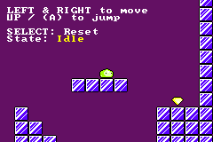 | 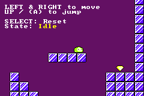 | 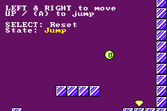 |

---

## ⚙️ 三、游戏二：FlxCollisions（全物理演示）变更与攻坚回顾

`FlxCollisions` 包含三大完全独立的物理演算宇宙，在移植过程中针对用户提出的多项疑难物理接触问题进行了系统的自愈性闭环重构：

```
                      ┌─────────────────────────────────┐
                      │    FlxCollisions (GBA 原生移植)  │
                      └────────────────┬────────────────┘
                                       │
         ┌─────────────────────────────┼─────────────────────────────┐
         ▼                             ▼                             ▼
  ┌──────────────┐              ┌──────────────┐              ┌──────────────┐
  │   Demo 1     │              │    Demo 2    │              │    Demo 3    │
  │  Warehouse   │              │  300 Blocks  │              │  Parts Rain  │
  │ 仓库推箱机构 │              │ 密集刚体大地图│              │ 零件雨与小车 │
  └──────────────┘              └──────────────┘              └──────────────┘
```

---

### 📦 变更回顾 1：Demo 1 Warehouse（仓库推箱与机构动力学）

#### 1. 发现的问题
1. **5 个白色木箱悬空离地**：用户反馈木箱底部与地面有明显悬空黑边。
2. **主角推不动木箱**：主角顶住箱体时如同幽灵穿透，无法向左、向右推动箱子。

#### 2. 根因剖析
- **重复偏移叠加**：切片时 10×10 木箱贴在 16×16 Sprite 的 `(3, 3)` 偏移处。原逻辑在物理碰撞和渲染层分别做了一次减 3，导致最终箱体在空中悬浮了 3 个像素。
- **状态逻辑短路（Ghost Crate）**：原逻辑将站立检测与推箱检测写成了嵌套的 `if-else`，站立判定未满足时直接把推箱分支短路截断，且未将主角速度传递给箱子。

#### 3. 重构方案与实测效果
- **唯一世界坐标体系**：`crates[i].x/y` 严格作为物理 Hitbox 坐标，地面对齐直接锁定 `cy = floor_y - 10`，渲染层单次对齐 `csy = cy - 3 - cam_y`。
- **推箱动力学解耦**：接触判定与推力传递解耦，推箱时将主角速度赋予木箱（`crates[i].vx = player.vx`），并加入箱体撞墙阻挡判定。

| 缺陷解决：0 像素绝对贴地 | 缺陷解决：主角平稳推箱 | 仓库全景（升降台、推杆与零件滑梯） |
| :---: | :---: | :---: |
| 5 个木箱底边与地面/平台严丝合缝，消除浮空感 | 主角贴紧木箱平稳推行，支持登上箱顶跳跃 | 往复升降台托举木箱，水平推杆推挤零件 |
| 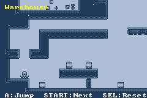 | 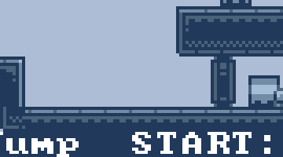 | 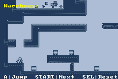 |

---

### 🌌 变更回顾 2：Demo 2 300 Blocks Universe（密集刚体反弹大宇宙）

#### 1. 发现的问题
- 用户在 RealVNC 截图中指出：**随机生成的密集刚体障碍块，金属零件直接穿透深蓝色方块，完全没有碰撞反弹**。

#### 2. 根因剖析
- 原 `is_solid()` 函数硬编码查询 Demo 1 的静态地图常量数组 `level_collision`。Demo 2 生成的 110 个 16×16 随机障碍方块仅向背景显存写入了瓦片编号（纯视觉贴图），**未在任何物理网格中登记**。
- `update_blocks()` 中对粒子的物理更新只做了屏幕外角检测，根本未调用障碍碰撞计算。

#### 3. 重构方案与实测效果
- **引入全动态通用物理碰撞网格 (`dynamic_collision[30][40]`)**：
  在模式初始化时，将四周边界墙及 110 个 16×16 密集障碍方块**同步写入显存与物理碰撞网格**。
- **连续 AABB 刚体高弹性反弹**：
  - 采用 1px 内缩三点采样检测行进前沿。
  - 碰撞时沿法线严丝合缝贴齐方块表面，水平与垂直速度完全反转（`vx = -vx`，`vy = -vy`），触发清脆打击音效。
  - 渲染层增加 `-1` 偏移，实现 6×6 零件贴图与 16×16 方块碰触瞬间的 0 像素绝对贴合。

| 用户反馈问题点（零件穿墙穿模） | 修复后：密集方块全向弹性反弹 | 修复后：D-PAD 镜头平移巡视宇宙 |
| :---: | :---: | :---: |
| 零件直接穿过深蓝色方块，无物理阻挡 | 零件在方块边缘精准发生弹性反弹，穿梭于迷宫中 | 平移镜头至大地图边缘，回廊碰撞同样严密 |
| 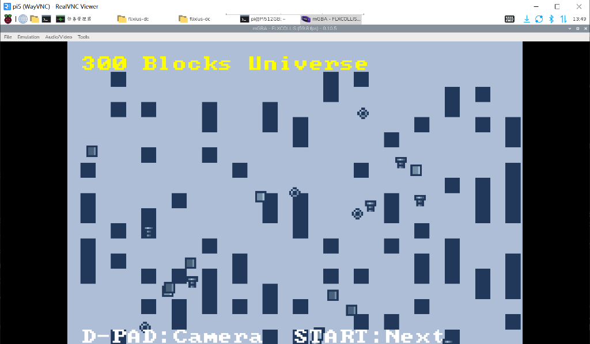 | 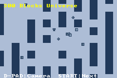 | 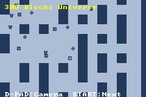 |

---

### 🌧️ 变更回顾 3：Demo 3 Parts Rain（零件之雨与移动小车堆叠）

#### 1. 发现的问题与原版诉求
- 用户上传了 HaxeFlixel 官方演示网站截图，指出：**“原来是对的，可以在平台上接住下落的物体”**。此前误将该模式当作“打砖块剧烈弹飞”，导致零件被炸飞或向两侧斜射，无法落在小车平台上。

#### 2. 原版 HaxeFlixel 核心机制比对
通过研读 HaxeFlixel 原版源码 `PlayState3.hx`：
- 发射器位于**正上方中央**（`(width - 64) / 2`），密集倾泻下落螺丝零件。
- 碰撞为**低弹性接触（Inelastic）**，零件接触平台后垂直速度迅速衰减归零，**稳稳停留在平台上**。
- 后续落下的零件在已有零件头顶互相堆叠，形成一座**壮观的“零件小山”**。
- 平台横移时，**整个零件堆随车同步平移**；速度过快或堆叠过高时边缘零件自然滑落倾泻。

#### 3. 重构方案与实测效果
- **发射源正中对齐**：零件集中从中央上方 `X: 95~145` 密集下泼，正对初始小车挡板。
- **触台吸附与承载平移 (Catch & Carry)**：
  零件触碰挡板时执行微阻尼吸附（`vy = 0`），每帧附加小车的水平位移（`gibs[i].x += paddle_dx`），实现绝对稳定的承载移动。
- **叠罗汉物理堆叠 (Multi-layer Stacking)**：
  检测落下的零件是否砸中下方静止零件实体，落在其上方（`gy = jy - 6`），重现原版堆积如山的物理奇观。
- **边缘物理滑落 (Edge Tumbling)**：
  超出挡板边缘的零件失去支撑，受重力自然翻滚滑落坠入深渊。

| HaxeFlixel 官方原版演示 | GBA 实机还原：平台接住并堆叠成山 | GBA 实机还原：小车横移带着零件堆平移 |
| :---: | :---: | :---: |
| 官方原版演示中零件在小车上堆积 | 密集落下的零件被小车精准接住，层层叠起成小山 | 左右开动小车，整个零件堆稳稳跟随平移并边缘滑落 |
| 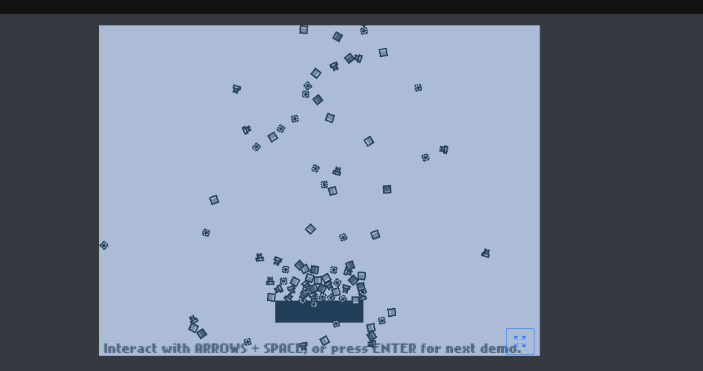 | 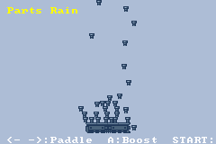 | 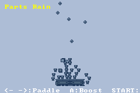 |

---

## 🕊️ 四、游戏三：Flappybalt（经典街机弹跳飞鸟）移植总结

### 1. 核心架构与街机框体适配
`Flappybalt` 原始分辨率为垂直竖屏 160×240。在 GBA 横屏（240×160）硬件上，我们巧妙结合昨天在树莓派 5 上的开发经验（平滑舒适物理参数 + 复古边框 HUD），打造了极具质感的**便携掌机街机框体模式（Arcade Cabinet Mode）**：

- **画幅与边框布局**：
  - **左侧边框（Cols 0~4, 40px）**：复古框体条纹、`GBA FLAP` 金色标题、`HI` 历史最高分、`SCOR` 实时分数。
  - **中央竞技场（Cols 5~24, 160px）**：160×160 黄金活动视野，包含上下双排密集致命尖刺、远景塔吊城市天际线、反弹指示侧轨。
  - **右侧边框（Cols 26~29, 40px）**：框体副标题 `BALT`、`[A] FLAP` 操作指南、`SEL MODE` 模式切换、`STA RST` 一键重置、`60FS` 硬件满帧指示。
- **舒适物理引擎与手感调优**：
  - 继承昨日 Dreamcast 移植的最佳物理手感参数（重力 $250.0$、跳跃冲量 $-155.0$、水平反弹航速 $62.0$、尖刺挡板航速 $135.0$）。
  - 消除撞墙剧烈弹飞与冲顶暴毙，起跳弧度平缓适度，留出充足的反应时间。
- **硬核 GBA 视听打击感（Juice）**：
  - **PSG 硬件声道 1 频偏音效**：起跳煽动翅膀时发出清脆上扬鸟鸣。
  - **PSG 硬件声道 2 撞墙提示**：触壁反弹并得分时触发金属铃铛声。
  - **PSG 硬件声道 4 白噪声爆破**：撞击尖刺时触发粉碎爆炸重音。
  - **GBA 硬件寄存器淡白闪光（`REG_BLDCNT`）与背景震动（`REG_BG1VOFS`）**：阵亡瞬间全屏高亮闪烁，摄像机剧烈抖动，伴随 10 颗纯白羽毛粒子四散飘零。
- **SRAM 历史最高分持久化**：
  - 写入 GBA 卡带 SRAM（`0x0E000000`），关机重启或换卡不丢失最高分。

### 2. Flappybalt 实机运行图解

| 画面 1：开场待命 (Idle) | 画面 2：振翅翱翔 (Flap) | 画面 3：反弹得分与尖刺挡板 (Score & Paddle) | 画面 4：阵亡复活与纪录保留 (Respawn & SRAM) |
| :---: | :---: | :---: | :---: |
| 鸽子中央悬停，HUD 提示 `PRESS A` | 按下 A 键展开双翅，在城市塔吊间滑翔 | 触碰右壁反弹得分，左壁伸出致命移动尖刺 | 阵亡后羽毛消散重置，SRAM 保留历史最高纪录 |
| 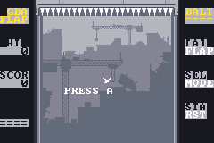 | 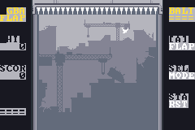 | 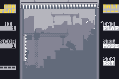 | 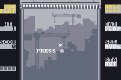 |

---

## 🏆 五、核心技术攻关成果对比总表

| 核心指标 | FlxFSM | FlxCollisions | Flappybalt |
| :--- | :--- | :--- | :--- |
| **GBA ROM 路径** | `./roms/flxfsm.gba` | `./roms/flxcollisions.gba` | `./roms/flappybalt.gba` |
| **ROM 编译体积** | **9.3 KB** | **19.8 KB** | **16.0 KB** |
| **运行时帧率** | 稳定 **60 FPS** 满帧 | 稳定 **60 FPS** 满帧（32 刚体无掉帧） | 稳定 **60 FPS** 满帧（羽毛粒子零卡顿） |
| **物理引擎机制** | 有限状态机驱动 + 晶体瓦片 AABB | 动态网格 + 扫掠 CCD + 平台堆叠 | 16.16 定点数平滑弹跳 + 挡板巡航 + 羽毛粒子 |
| **视听与特效** | GBA 通道 1/2 方波合成 | 硬件通道 4 伪随机白噪声引擎 | 硬件淡白闪烁 (`REG_BLDCNT`) + 摄像机震颤 + PSG 3声道 |
| **存档持久化** | 内存易失运行 | 内存易失运行 | **卡带 SRAM (`0x0E000000`) 永久保存最高分** |
| **演示模式** | 完整横版跳跃平台关卡 | 3 大独立演示场景（随时热切） | 框体竞技场 / 竖屏卷轴双模式切换 |

---

## 🚀 六、运行与体验指南

### 1. Windows 本地运行
你可以直接使用任意 GBA 模拟器（如 mGBA、VisualBoyAdvance）打开 `./roms/` 目录下的三个 ROM 文件：
- `D:\ai\my-llm-test\gemini-3.8-flash\gemini-gba\roms\flxfsm.gba`
- `D:\ai\my-llm-test\gemini-3.8-flash\gemini-gba\roms\flxcollisions.gba`
- `D:\ai\my-llm-test\gemini-3.8-flash\gemini-gba\roms\flappybalt.gba`

### 2. 树莓派 5 远程实机运行
在树莓派终端中直接输入以下命令启动：
```bash
# 启动 FlxFSM
mgba-qt /home/pi/gba-projects/flx-fsm/flxfsm.gba

# 启动 FlxCollisions
mgba-qt /home/pi/gba-projects/flx-collisions/flxcollisions.gba

# 启动 Flappybalt
mgba-qt /home/pi/gba-projects/flappybalt-gba/flappybalt.gba
```

### 3. 操作按键映射表

| GBA 按键 | 键盘对应映射 (mGBA 默认) | FlxFSM 功能 | FlxCollisions 功能 | Flappybalt 功能 |
| :---: | :---: | :---: | :---: | :---: |
| **十字键** | 方向键 Left / Right / Up / Down | 左右移动 / 起跳 | 推箱 / 镜头平移 / 移动小车 | Up 键同样支持起跳跳跃 |
| **A 键 / B 键** | X 键 / Z 键 | 起跳 | 主角起跳 / 小车 3 倍极速冲刺 | **扇翅起跳（Flap）/ 开始游戏** |
| **START 键** | Enter 键 | — | 热切换三大物理模式 | **一键重置当前局** |
| **SELECT 键** | Backspace 键 | 一键重置关卡 | 一键重置物理场景 | **切换画幅模式 (Arcade Fit / Classic Scroll)** |

