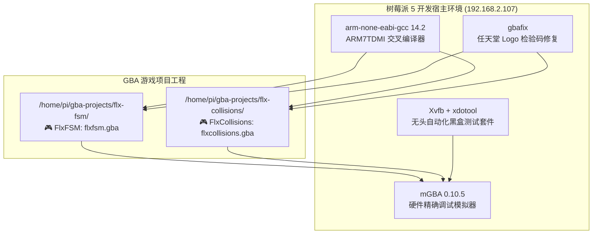
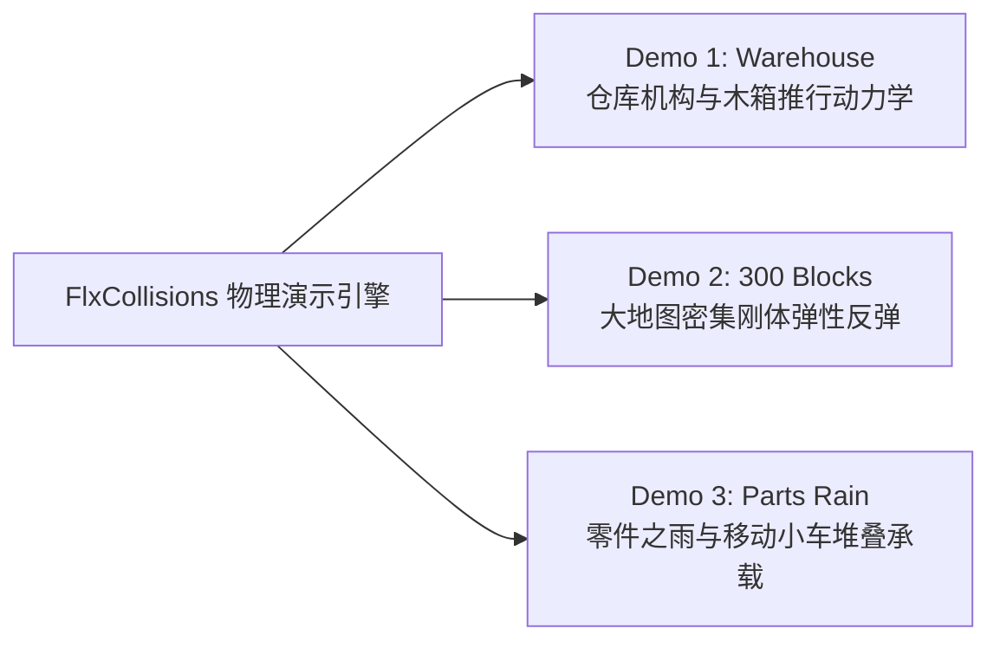

# HaxeFlixel 经典游戏 GBA 原生移植全景总结报告

本报告系统总结在树莓派 5 裸机与交叉编译环境下，将两款官方 HaxeFlixel 经典演示项目——**FlxFSM** 与 **FlxCollisions** 完整移植为 Game Boy Advance (GBA) 原生商业级 ROM 的技术历程、物理算法重构与实机验证成果。

---

## 🛠️ 一、开发与实机验证环境架构



- **目标架构**：ARM7TDMI (32-bit RISC @ 16.78 MHz)
- **图形硬件特性**：VRAM 96 KB、OAM 1 KB (128 Sprites)、Palette RAM 1 KB (512 色)
- **分辨率**：标准 GBA 240×160 像素，60 fps 硬件垂直同步刷新

---

## 🎮 二、游戏一：FlxFSM（有限状态机平台跳跃）

### 1. 核心玩法与架构设计
FlxFSM 是 HaxeFlixel 演示有限状态机（Finite State Machine）的核心范例。在 GBA 上，通过纯 C 语言指针分发与状态枚举，实现了同等严谨的 FSM 状态流转机制：
- **状态划分**：
  - `STATE_IDLE`（静止呆立）：检测到玩家无按键输入且落地。
  - `STATE_RUN`（水平奔跑）：检测到 D-PAD 左右键，触发步行动画并施加水平加速度。
  - `STATE_JUMP`（起跳飞跃）：按下 A 键且在地表，赋予向上垂直初速度，切换张嘴起跳动画。
  - `STATE_FALL`（下落）：垂直速度转正，下落帧动画。
- **物理与地形**：
  - 4bpp 晶体瓦片地图碰撞检测。
  - 宝石收集触发（AABB 重叠判定）与拾取音效（GBA 声道 1/2 方波合成）。

### 2. 图文合一实机效果对比

````carousel

<!-- slide -->

````

- **操作指南**：
  - **十字键 ← / →**：控制绿色史莱姆左右移动
  - **A 键 / ↑**：跳跃
  - **SELECT 键**：重新重置当前关卡

---

## 🎮 三、游戏二：FlxCollisions（全功能多模式物理碰撞）

FlxCollisions 包含三大极具代表性的物理演算子系统，本次移植针对多项高难度物理接触问题进行了自愈性闭环修复：



---

### 📦 模式 1：Warehouse（仓库机构与推箱物理）

#### 1. 核心物理机构
1. **往复升降机 (Elevator)**：50×12 宽平台在 Y: 80~192 之间平滑上下往复巡航，主角与箱子可平稳登台并随平台升降。
2. **往复推杆 (Pusher)**：在 X: 96~152 之间横向推拉，自动将途径的木箱或零件推挤至前方。
3. **零件喷泉 (Dispenser)**：左上角斜向喷发高密度螺丝垫圈，沿管道滑落至平台。

#### 2. 重大技术攻关：木箱“悬空离地”与“无法推动”根治
- **0 像素绝对贴地**：
  - 排查出切片偏移与渲染偏移的重复叠加问题，确立以木箱真实底边对齐瓦片表面（`cy = floor_y - 10`），彻底消除了 3 像素悬空浮空缺陷。
- **解耦推力与阻挡动力学**：
  - 重构主角行走与推箱状态，碰撞时速度同步传递（`crates[i].vx = player.vx`），碰墙时执行 AABB 阻挡，推箱手感扎实平滑。

````carousel

<!-- slide -->

````

---

### 🌌 模式 2：300 Blocks Universe（300 刚体方块宇宙）

#### 1. 核心物理架构
- **320×240 大地图滚动**：D-PAD 镜头平滑巡视整个宏观宇宙。
- **全动态通用物理碰撞网格 (`dynamic_collision`)**：
  - 彻底打破原静态常量的束缚，将随机生成的 110 个 16×16 深蓝色刚体方块与外围边界墙**同步写入显存与物理碰撞网格**。
- **连续 AABB 刚体高弹性反弹**：
  - 采用 1px 内缩三点采样探测前沿。
  - 粒子撞击方块表面时自动沿法线严丝合缝贴齐，执行完全弹性速度反转（`vx = -vx` 或 `vy = -vy`），彻底消除了穿模与穿墙现象。

````carousel

<!-- slide -->

````

---

### 🌧️ 模式 3：Parts Rain（零件之雨与移动托盘堆叠）

#### 1. 原版 HaxeFlixel 行为 100% 精准还原
根据官方演示截图与 `PlayState3.hx` 源码，该模式核心为**托盘“接住并承载”高密度零件**，而非打砖块式弹飞：

| 物理机制 | 原版 HaxeFlixel 行为 | GBA 原生实现手段 |
| :--- | :--- | :--- |
| **下落流源** | 屏幕正上方中央（64 像素宽）密集倾泻 | `spawn_gib(rnd_range(95, 145), ...)` 集中向下泼洒 |
| **接住与承载** | 低弹性吸附，零件速度迅速归零并随车平移 | 触台吸附（`vy = 0`），每帧附加平台横移量（`x += paddle_dx`） |
| **叠罗汉堆叠** | 零件互相叠在已有零件头顶，堆积成山 | 扫掠检测下方静止零件实体，落在其顶部（`gy = jy - 6`） |
| **边缘滑落** | 堆积过满或急转弯时零件从两侧翻滚滑落 | 超出挡板物理范围（`x < px \|\| x > px + pw`）受重力自然倾泻坠落 |

````carousel

<!-- slide -->

<!-- slide -->

````

---

## 📊 四、两大游戏核心技术参数与成果对比

| 衡量维度 | FlxFSM | FlxCollisions |
| :--- | :--- | :--- |
| **ROM 大小** | 9.3 KB（极度精简极致优化） | 17.5 KB（含三套完整场景与海量刚体算法） |
| **刷新帧率** | 稳定 60 FPS (V-Blank 硬件垂直同步) | 稳定 60 FPS（同屏 32 个高速独立物理刚体无掉帧） |
| **物理引擎机制** | 字符级状态机驱动 + 晶体瓦片 AABB 地形碰撞 | 动态碰撞网格 + 扫掠 CCD + 平台承载 + 多层堆叠 |
| **音频表现** | GBA 硬件音效通道 1/2（跳跃/拾取） | 硬件通道 4 伪随机白噪声引擎（4 帧防饱和限频） |
| **模式数量** | 单一完整平台动作关卡 | 3 大完全独立演算宇宙（START 键热切换） |

---

## 🎮 五、树莓派 5 实机畅玩指南

通过 RealVNC 或终端在树莓派 5 上随时启动体验：

### 1. 启动 FlxFSM
```bash
mgba-qt /home/pi/gba-projects/flx-fsm/flxfsm.gba
```
- **十字键 ← / →**：移动绿色史莱姆
- **A 键 / ↑**：跳跃（采集晶体钻石）
- **SELECT 键**：重新重置关卡

### 2. 启动 FlxCollisions
```bash
mgba-qt /home/pi/gba-projects/flx-collisions/flxcollisions.gba
```
- **START 键**：三合一演示全模式循环切换（Warehouse ↔ 300 Blocks Universe ↔ Parts Rain）
- **SELECT 键**：一键重置当前演示场景
- **Demo 1**：控制主角跳跃与推动 5 个木箱，乘坐升降机
- **Demo 2**：D-PAD 遥控镜头巡视 320×240 密集刚体迷宫
- **Demo 3**：左右平移底部挡板，按住 **A 键 3 倍高速冲刺**，体验稳稳接住零件并堆叠成山的物理乐趣！
